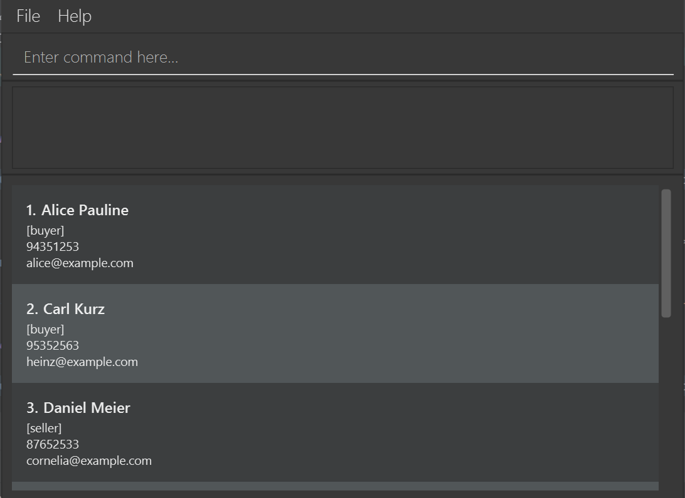
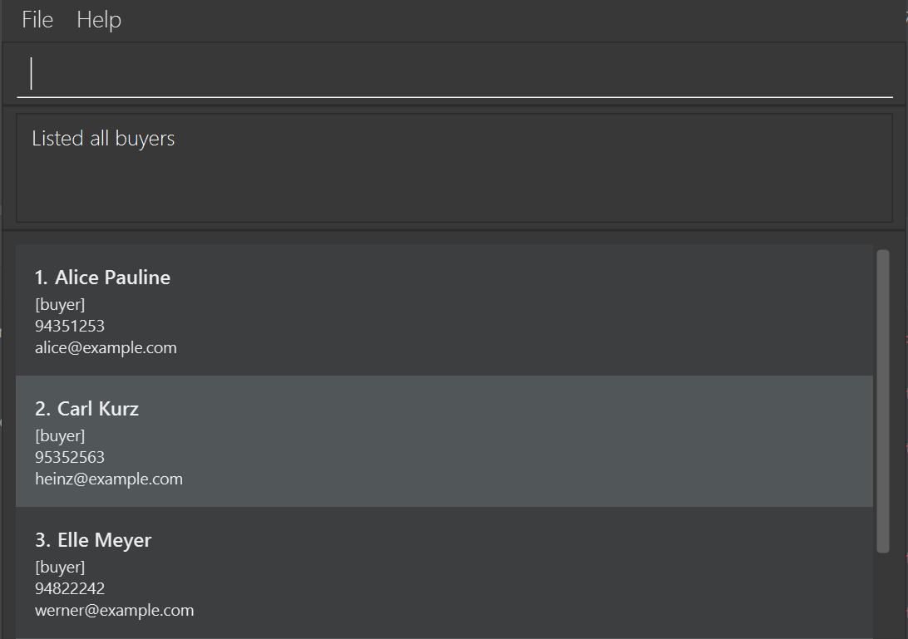
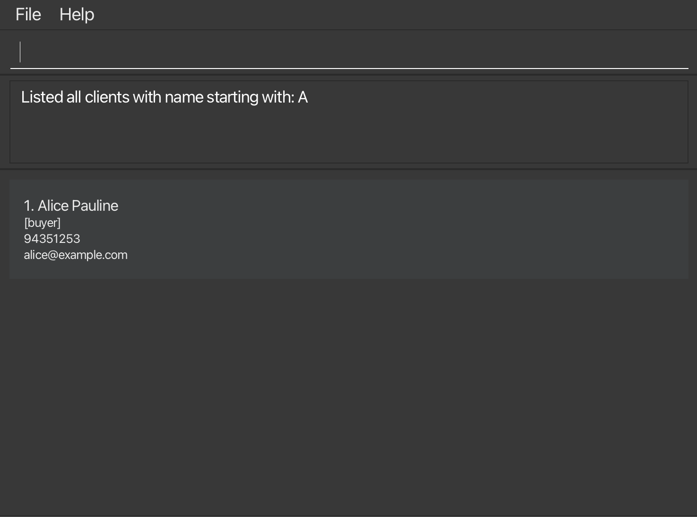
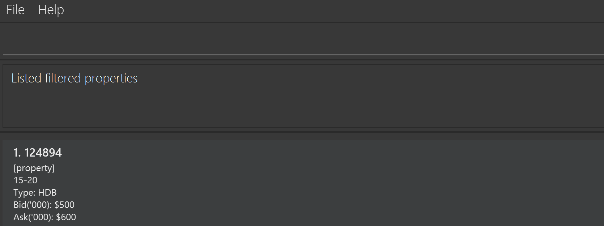

# Client Grid User guide

ClientGrid is an **address book** targeted for English-speaking real estate agents within Singapore to efficiently manage client contacts, including buyers and sellers. It provides a streamlined way to organize client data and monitor the buying or selling process while maintaining core address book functionality. The default language of communication of ClientGrid is English.


<!-- * Table of Contents -->
<page-nav-print />

--------------------------------------------------------------------------------------------------------------------

## Quick start

1. Ensure you have Java `17` or above installed in your Computer.

1. Download the latest `.jar` file from [here](https://github.com/AY2425S1-CS2103T-T16-2/tp/releases).

1. Copy the file to the folder you want to use as the _home folder_ for ClientGrid.

1. Open a command terminal, `cd` into the folder you put the jar file in, and use the `java -jar clientGrid.jar` command to run the application.<br>
   A GUI similar to the below should appear in a few seconds. Note how the app contains some sample data.<br>
   

1. Type the command in the command box and press Enter to execute it. e.g. typing **`help`** and pressing Enter will open the help window.<br>
   Some example commands you can try:

   * `list k/clients` : Lists all clients.

   * `addbuyer n/John p/12345678 e/john@gmail.com` : Adds a buyer whose name is `John`, phone number is `12345678` and email is `john@gmail.com`.

   * `deletebuyer p/81234567` : Deletes the buyer with contact number `81234567`.
   
   * `addproperty c/124894 u/15-20 t/HDB a/50000 b/10000` : Adds a property with postal code 124894 and unit number #15-20 whose type is a HDB with an ask price of $50000 and bid price of $10000.
   
   * `filterproperty t/HDB gte/500 lte/15000` : Filters and lists properties which is type HDB and matching price (average of ask and bid price) is greater than $500 and less than $15000.
   
   * `deleteproperty c/124894 u/15-20` : Deletes the property with postal code 124894 and unit number #15-20.

   * `exit` : Exits the app.

1. Refer to the [Features](#features) below for details of each command.

--------------------------------------------------------------------------------------------------------------------

## Features

<box type="info" seamless>

**Notes about the command format:**<br>

* Words in `UPPER_CASE` are the parameters to be supplied by the user.<br>
  e.g. in `addbuyer n/NAME`, `NAME` is a parameter which can be used as `add n/John Doe`.

* Parameters can be in any order.<br>
  e.g. if the command specifies `n/NAME p/PHONE_NUMBER`, `p/PHONE_NUMBER n/NAME` is also acceptable.

* If you are using a PDF version of this document, be careful when copying and pasting commands that span multiple lines as space characters surrounding line-breaks may be omitted when copied over to the application.
</box>

### Viewing help : `help`

Shows a message explaning how to access the help page.


Format: `help`

### Listing address book records: `list`

Shows a list of all existing clients (i.e. buyers and sellers), properties, and meetings in the address book.

Format: `list k/KEY`

* The `list` command displays records based on the specified `KEY`.
* The `KEY` must be one of the following: `buyers`, `sellers`, `clients`, `meetings` or `properties`.
  * `buyers`: Lists all buyers in the database.
  * `sellers`: Lists all sellers in the database.
  * `clients`: Lists all buyers and sellers (i.e. clients) combined.
  * `properties`: Lists all properties in the database.
  * `meetings`: Lists all meetings in the database.

* If an invalid `KEY` is provided, an error message will be displayed.

Key Considerations:
* Only accepts "buyers", "sellers", "clients", "properties" and "meetings" (case-insensitive) as valid inputs for k/KEY.
* The `KEY` ignores extra/leading/trailing spaces. Extra/leading/trailing spaces will be trimmed and the name will be converted into an array of words. The `KEY` also ignores UPPER/lower case. All names will be converted to lower case and checked against the list of valid keys.
* If the user provides an invalid key, the system will respond with an error message indicating that only the valid keys are accepted.

Examples:
* `list k/buyers` displays a list of all existing buyers in the address book.

  

### Adding a buyer : `addbuyer`

Add a specified buyer into the client book of ClientGrid.

Format: `addbuyer n/BUYER_NAME p/BUYER_PHONE_NUMBER e/BUYER_EMAIL`

* Adds a buyer with the specified `BUYER_NAME`, `BUYER_PHONE_NUMBER`, and `BUYER_EMAIL`.
* The `BUYER_NAME` ignores extra/leading/trailing spaces. Extra/leading/trailing spaces will be trimmed and the name will be converted into an array of words. The `BUYER_NAME` also ignores UPPER/lower case. All names will be converted to lower case and checked against the in-memory database.
* The `BUYER_PHONE_NUMBER` should only contain 8 numbers in the range [0-9] and can only start with '8' or '9'. Spaces are not allowed between the 8 numbers.
* The `BUYER_EMAIL` should be of the format local-part@domain and adhere to the following constraints: 
  * The local-part should only contain alphanumeric characters and these special characters, excluding the parentheses, (`+`, `_`, `.`, `-`). 
    * The local-part may not start or end with any special characters and must not contain consecutive special characters.
  * This is followed by a '@' and then a domain name. The domain name is made up of domain labels separated by periods.
  * The domain name must:
    * end with a domain label at least 2 characters long 
    * have each domain label start and end with alphanumeric characters
    * have each domain label consist of alphanumeric characters, separated only by hyphens, if any.

Examples:
* `addbuyer n/John p/83456789 e/john@gmail.com` adds a buyer whose name is `John`, phone number is `83456789` and email is `john@gmail.com`.

  

### Filtering clients : `filterclient`

Filters the clients that starts with the prefix provided.

Format: `filterclient n/NAME`

* Filters the client with the specified prefix `NAME`.
* The `NAME` also ignores UPPER/lower case. All names will be converted to lower case and checked against the clientbook.

Examples:
* `filterclient n/A` filters the clients that starts with the prefix `A`.

  

### Adding a seller : `addseller`

Add a specified seller into the client book of ClientGrid.

Format: `addseller n/SELLER_NAME p/SELLER_PHONE_NUMBER e/SELLER_EMAIL`

* Adds a seller with the specified `SELLER_NAME`, `SELLER_PHONE_NUMBER`, and `SELLER_EMAIL`.
* The restrictions for the `SELLER_NAME`, `SELLER_PHONE_NUMBER` and `SELLER_EMAIL` are identical to the restrictions for the `BUYER_NAME`, `BUYER_PHONE_NUMBER` and `BUYER_EMAIL` specified in the `addbuyer` feature.

Examples:
* `addseller n/Mary p/83456789 e/mary@gmail.com` adds a seller whose name is `Mary`, phone number is `83456789` and email is `mary@gmail.com`.

  

### Deleting a buyer : `deletebuyer`

Deletes the specified buyer from the client book of ClientGrid.

Format: `deletebuyer p/PHONE_NUMBER`

* Deletes the buyer with the specified `PHONE_NUMBER`.
* The `PHONE_NUMBER` must be 8 numbers in the range [0-9] and can only start with ‘8’ or ‘9’.


Examples:
* `deletebuyer p/83456789` deletes the buyer with phone number `83456789` from the client book.
  

### Deleting a seller : `deleteseller`

Deletes the specified seller from the client book of ClientGrid.

Format: `deleteseller p/PHONE_NUMBER`

* Deletes the seller with the specified `PHONE_NUMBER`.
* The `PHONE_NUMBER` must be 8 numbers in the range [0-9] and can only start with ‘8’ or ‘9’.

Examples:
* `deleteseller p/83456789` deletes the seller with phone number `83456789` from the client book.

    

### Adding a property : `addproperty`

Add a specified property into the property book of ClientGrid.

Format: `addproperty c/POSTAL_CODE u/UNIT_NUMBER t/TYPE a/ASK b/BID`

* Adds a property of `TYPE` with the specified `POSTAL_CODE` and `UNIT_NUMBER` with seller's `ASK` price (in thousand) and buyers `BID` price (in thousand).
* The `POSTAL_CODE` must be a non-negative integer and contain exactly 6 numeric characters.
* The `UNIT_NUMBER` must contain numbers delimited by a dash, and numbers on either side of the dash must be at least 2 characters long with no excess padding. The range of numbers of the left hand side of the dash is [00-148] and the right hand side is [00-111110]";
* The `TYPE` must be one of the following values (case-insensitive): HDB, CONDO, or LANDED.
* The `ASK` must be a non-negative integer smaller than 1,000,000 (thousand) with only numeric characters.
* The `BID` must be a non-negative integer smaller than 1,000,000 (thousand) with only numeric characters.

<box type="info" seamless>

**Note:**
No duplicate properties are allowed. Duplicate properties are checked based on:

1. if either of two properties are of LANDED type, then the comparison is done based on postal code.
2. if the two properties are CONDO and HDB type, then the comparison is done based on postal code.
3. if the two properties are both CONDO or HDB type, then the comparison is done based on postal code and unit.
</box>
<box type="important" seamless>

**Unit defaults**
The Unit parameter for `LANDED` properties will default to 00-00 regardless of the unit value placed. This is because, a landed property is not segmented into multiple apartments and therefore, deemed to be a unit in itself.
</box>

Examples:
* `addproperty c/124894 u/15-20 t/HDB a/50000 b/10000` : Adds a property with postal code 124894 and unit number #15-20 whose type is a HDB with an ask price of $50000 and bid price of $10000.

  

### Filtering properties : `filterproperty`

Filters the properties based on any combination of type, lower bound for matching price and upper bound for matching price.

Format: `filterproperty [t/TYPE] [gte/MATCHING_PRICE] [lte/MATCHING_PRICE]`

* Filters the properties with any combination of `TYPE`, lower bounded `MATCHING_PRICE` and upper bounded `MATCHING_PRICE`.
* The `TYPE` is case-insensitive HDB, CONDO or LANDED.
* The `MATCHING_PRICE` is a non-negative integer (i.e. No non-numeric symbols such as decimal points, currency symbols, etc.).

* <box type="definition" seamless>

**Matching Price**: The true price of the property given by the average of the property's lowest Ask price and highest Bid price.
</box>
<box type="warning" seamless>

**Important**
1. At least one optional prefix needs to be present for any filtering to be possible.
2. Prices denoted in `gte/` and `lte/` parameters are checked based on the 'AND' condition. For example, `filterproperty gte/500 lte/60000` filters for properties greater than $500 and less than $60000.
   </box>

Examples:
* `filterproperty t/HDB gte/500 lte/60000` filters the properties for HDB with a lower bounded matching price of $500 and upper bounded matching price of $60000.

  

### Deleting a property : `deleteproperty`

Deletes a specified property from the property book of ClientGrid.

Format: `deleteproperty c/POSTAL_CODE u/UNIT_NUMBER`

* Deletes a property with the specified `POSTAL_CODE` and `UNIT_NUMBER`.
* The `POSTAL_CODE` must be exactly 6 digits with each digit in the range [0-9]. It does not accept any non-integer characters or spaces.
* The `UNIT_NUMBER` comprises of two numbers delimited by exactly one dash(-). On either side of the dash are numbers comprising of two or more digits. The range of numbers of the left hand side of the dash is [00-148] and the right hand side is [00-111110]. Other than the dash, other non-integer characters or spaces are not accepted.

Examples:
* `deleteproperty c/123456 u/01-01` deletes a property with postal code `123456` and unit number `01-01`.

  

### Adding a meeting : `addmeeting`

Adds a specified meeting to the meeting book of ClientGrid.

Format: `addmeeting mt/MEETING_TITLE d/MEETING_DATE bp/BUYER_PHONE sp/SELLER_PHONE t/TYPE c/POSTALCODE`

* Adds a meeting with the specified `MEETING_TITLE` and `MEETING_DATE`.
* The `MEETING_TITLE` should only contain alphanumeric characters and spaces, and it should not be blank.
* The `MEETING_DATE` should be in the format dd-MM-yyyy and must be a valid date.
* `BUYER_PHONE` refers to a buyer's phone number. There must be an existing buyer in the client book that has a phone number that is equal to the `BUYER_PHONE`.
* `SELLER_PHONE` refers to a seller's phone number. Likewise, there must be an existing seller in the client book with a phone number equal to `SELLER_PHONE`.
* Both `BUYER_PHONE` and `SELLER_PHONE` should only contain 8 numbers in the range [0-9] and can only start with '8' or '9'. Spaces are not allowed between the 8 numbers.
* `TYPE` refers to a property type. It must be one of the following values (case-insensitive): `CONDO`, `HDB`, or `LANDED`.
* `POSTALCODE` refers to a postal code. The postal code must belong to some existing property in the property book of the specified `TYPE`.

Examples:
* `addmeeting mt/Meeting 1 d/01-01-2025 bp/95352563 sp/87652533 t/HDB c/123456` adds a meeting with meeting title `Meeting 1` and meeting date `01-01-2025`.

  

### Deleting a meeting : `deletemeeting`

Deletes a specified meeting from the meeting book of ClientGrid.

Format: `deletemeeting mt/MEETING_TITLE d/MEETING_DATE`

* Deletes a meeting with the specified `MEETING_TITLE` and `MEETING_DATE`.
* The `MEETING_TITLE` should only contain alphanumeric characters and spaces, and it should not be blank.
* The `MEETING_DATE` should be in the format dd-MM-yyyy and must be a valid date.

Examples:
* `deletemeeting mt/Meeting 1 d/01-01-2024` deletes a meeting with meeting title `Meeting 1` and meeting date `01-01-2024`.

  

### Exiting the program : `exit`

Exits the program.

Format: `exit`

### Saving the data

ClientGrid data are saved in the hard disk automatically after any command that changes the data. There is no need to save manually.

### Editing the data file

Client, meeting, and property data are automatically saved as separate JSON files in `[JAR file location]/data/`:
- `clientbook.json` for client (i.e. buyers and sellers) entries
- `meetingbook.json` for meeting entries
- `propertybook.json` for property entries

```css
📁 [JAR file location]
└── 📁 data
    ├── clientbook.json
    ├── meetingbook.json
    └── propertybook.json
```
Advanced users are welcome to directly update data by editing these individual files in the data directory.

<box type="warning" seamless>

**Caution:**
If your changes to the data file makes its format invalid, ClientGrid will discard all data and start with an empty data file at the next run.  Hence, it is recommended to take a backup of the file before editing it.<br>
Furthermore, certain edits can cause ClientGrid to behave in unexpected ways (e.g., if a value entered is outside the acceptable range). Therefore, edit the data file only if you are confident that you can update it correctly.
</box>


--------------------------------------------------------------------------------------------------------------------

## FAQ

**Q**: How do I transfer my data to another Computer?<br>
**A**: Install the app in the other computer and overwrite the empty data files it creates with the files that contains the data of your previous ClientGrid home folder. ([See Data File Structure](#editing-the-data-file))<br>
**Q**: Can buyers and sellers have the same phone number?<br>
**A**: Yes. A single client can be both a buyer and a seller of properties and can use the same phone number in both roles. However, two different buyers or two different sellers cannot share the same phone number.

--------------------------------------------------------------------------------------------------------------------

## Known issues

1. **When using multiple screens**, if you move the application to a secondary screen, and later switch to using only the primary screen, the GUI will open off-screen. The remedy is to delete the `preferences.json` file created by the application before running the application again.
2. **If you minimize the Help Window** and then run the `help` command (or use the `Help` menu, or the keyboard shortcut `F1`) again, the original Help Window will remain minimized, and no new Help Window will appear. The remedy is to manually restore the minimized Help Window.

--------------------------------------------------------------------------------------------------------------------

## Command Summary

| Action                | Format, Examples                                                                               |
|-----------------------|------------------------------------------------------------------------------------------------|
| **Help**              | `help`                                                                                         |
| **List**              | `list k/KEY`                                                                                   |
| **Add Buyer**         | `addbuyer n/BUYER_NAME p/BUYER_PHONE_NUMBER e/BUYER_EMAIL`                                     |
| **Add Seller**        | `addseller n/SELLER_NAME p/SELLER_PHONE_NUMBER e/SELLER_EMAIL`                                 |
| **Filter Clients**    | `filterclient n/NAME`                                                                          |
| **Delete Buyer**      | `deletebuyer p/PHONE_NUMBER`                                                                   |
| **Delete Seller**     | `deleteseller p/PHONE_NUMBER`                                                                  |
| **Add Property**      | `addproperty c/POSTAL_CODE u/UNIT_NUMBER t/TYPE a/ASK b/BID`                                   |
| **Filter Properties** | `filterproperty t/TYPE gte/MATCHING_PRICE lte/MATCHING_PRICE`                                  |
| **Delete Property**   | `deleteproperty c/POSTAL_CODE u/UNIT_NUMBER`                                                   |
| **Add Meeting**       | `addmeeting mt/MEETING_TITLE d/MEETING_DATE bp/BUYER_PHONE sp/SELLER_PHONE t/TYPE c/POSTALCODE` |
| **Delete Meeting**    | `deletemeeting mt/MEETING_TITLE d/MEETING_DATE`                                                |
| **Exit**              | `exit`                                                                                         |


